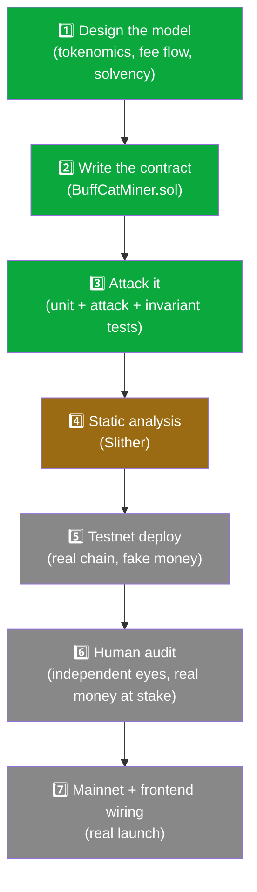
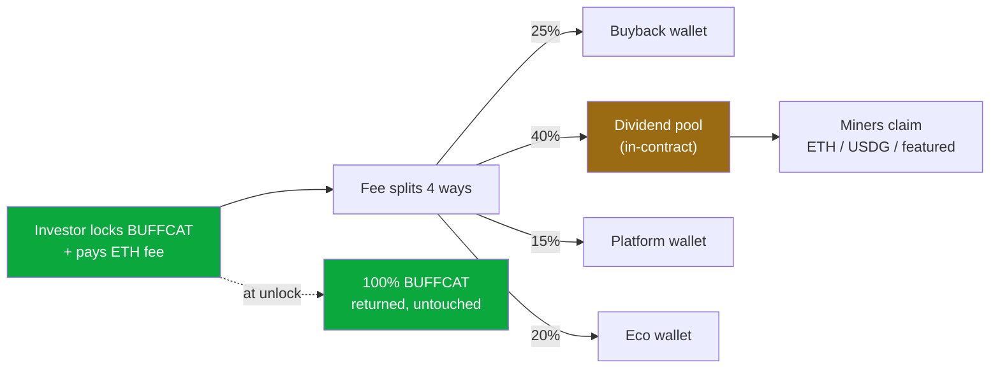
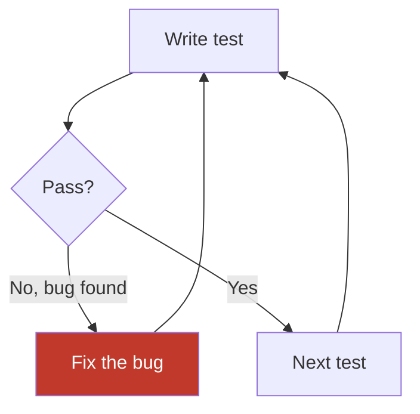

# 🐱 BuffCat Miner — Progress Tracker

> Last updated: 2026-07-16
> Branch: `feature/buffcat-miner` · Latest commit: `2099c14`
> Status: **Contract built + tested. Not deployed. Not audited. No real funds yet.**

---

## 🥋 The 7-Step Ritual

This is the fixed path from idea to mainnet. We do not skip steps, and we do not
reorder them. Each step has a hard gate — you don't move to the next one until
the current one is genuinely done, not "probably fine."



**Green = done. Gold = in progress / next up. Gray = not started.**

We are currently sitting right at the boundary of **Step 3 → Step 4**.

---

## ✅ Step 1 — Design the model *(DONE)*

The hardest part wasn't the code — it was making sure the money flows couldn't
be gamed or go insolvent. Key decisions locked in:

- **Lock BUFFCAT** as principal → always returned 100% at unlock, never touched
- **ETH platform fee** (flat, owner-adjustable within hard caps — **no oracle**,
  confirmed unnecessary after studying a live reference contract on Robinhood
  Chain that uses the same pattern)
- **Fee splits 4 ways**: 25% buyback / 40% dividends / 15% platform / 20% eco
- **Dividends** paid in ETH / USDG / featured pair (investor's choice) — funded
  by the fee, never by other users' principal (the two pools never mix)
- **Tiers**: Tourist (1d, 1.0×) → Ascended (100yr, 6.0× cap)
- **BUFF'mania featured campaign**: snapshot-gated so front-runners earn zero,
  1.3× bonus for participants, project-funded pot (e.g. NVDA)
- **Compounding**: 2% fee (half the deposit fee), preserves already-earned
  dividends, no free-rider leak
- **Early exit**: 10% penalty → 70% to stayers / 15% platform / 15% buyback
- **Gas**: O(1) Batog accumulator everywhere — **the contract never loops over
  users**, so it can't brick at scale the way naive "miner" contracts do



**Why it's solvent:** principal (BUFFCAT) and dividends (ETH) are different
assets in separate pools. A payout can never exceed the fees actually
collected. Proven, not just argued — see Step 3.

---

## ✅ Step 2 — Write the contract *(DONE)*

- `src/BuffCatMiner.sol` — ~440 lines
- Reentrancy-guarded, checks-effects-interactions throughout
- Custom errors (gas-cheap), immutable wallets, packed storage
- Fee-on-transfer-safe (measures actual balance deltas, never trusts
  requested amounts)

**Files:**
```
contracts/
├── src/
│   └── BuffCatMiner.sol
├── test/
│   ├── BuffCatMiner.t.sol      (core behaviors)
│   ├── Attacks.t.sol            (reentrancy, double-claim/unlock)
│   ├── HostileToken.t.sol       (fee-on-transfer tokens)
│   ├── Featured.t.sol           (front-run resistance)
│   ├── Compound.t.sol           (compounding correctness)
│   ├── Invariant.t.sol          (128k-call fuzzing)
│   └── Mocks.sol
├── remappings.txt
└── foundry.toml
```

---

## ✅ Step 3 — Attack it *(DONE — 20/20 passing)*

Ran on your own Mac, not just the sandbox — this is the real, trustworthy result.

| Suite | Tests | What it proves |
|---|---|---|
| `BuffCatMiner.t.sol` | 7 | Principal returned in full, fee split exact, tiers correct, min-hold enforced |
| `Attacks.t.sol` | 3 | **A live attacker cannot steal a co-staker's dividends via reentrancy**; no double-claim, no double-unlock |
| `HostileToken.t.sol` | 2 | Even a hostile fee-on-transfer token can't break solvency |
| `Featured.t.sol` | 2 | **A front-runner who locks after the campaign snapshot earns zero** — the MEV attack you were worried about is defeated |
| `Compound.t.sol` | 3 | 2% fee applied correctly, hashpower boosts correctly, **already-earned dividends are preserved, not wiped** |
| `Invariant.t.sol` | 3 | **128,000 random operations, 0 reverts** — solvency held under every sequence the fuzzer could generate |

### 🐛 Two real bugs found and fixed during this step

These would have shipped and cost real users money if we hadn't tested this hard:

1. **Featured eligibility was backwards.** The original logic made it
   impossible for anyone to ever qualify for the featured campaign. Fixed with
   a gas-safe "pending → eligible" promotion model (O(1), no loops).
2. **Compounding wiped pending dividends.** Reinvesting your earned ETH used
   to zero out dividends you'd already earned but hadn't claimed yet. Fixed
   with delta-debt accounting that preserves what's already owed.



---

## ⏳ Step 4 — Static analysis (Slither) *(NEXT)*

Slither reads the contract without running it and flags known vulnerability
*patterns* — the things a human might not think to write a test for.
Complements Step 3; doesn't replace it.

```bash
cd ~/Desktop/bufftoken-on-robinhood/contracts
pip3 install slither-analyzer
slither src/BuffCatMiner.sol
```

**Gate to pass:** no high/medium findings left unaddressed. Low/informational
findings get triaged (fix or consciously accept with a written reason).

---

## ⬜ Step 5 — Testnet deploy *(NOT STARTED)*

- Deploy to Robinhood Chain **testnet** (fake money, real chain behavior)
- Verify source on Blockscout
- Click every single button yourself: lock, claim, compound, early-exit,
  set featured, fund featured, pause
- **Specifically test:** funding + distributing NVDA end-to-end, to confirm
  there's no transfer restriction blocking it
- Let it soak for at least a day before trusting it

---

## ⬜ Step 6 — Human audit *(NOT STARTED)*

- Independent third-party review — **Claude's testing is not a substitute
  for this.** I found two real bugs; a paid human auditor is trained to find
  the kind I can't.
- Do not skip this because testnet "looked fine." Looking fine is not the bar
  for a contract that will hold other people's money.

---

## ⬜ Step 7 — Mainnet + frontend wiring *(NOT STARTED)*

- Deploy to mainnet with the 4 real wallets (already validated):
  - Buyback: `0xEBFB19E12810039Fba51fABe9D45Fdd8A8342707`
  - Platform: `0x640e846504b8b179885E36fF9FcC353Bf08F4b1F`
  - Eco: `0x13864051772FDFBce895d21a483eee02edaeB445`
  - Owner/Deployer: `0xc2413696576176d1e31D55a2DEdA609906a15596`
- Wire `mining.html` / `mining.js` to the live contract address
- Update the mining page's "Coming soon" badge → live
- Publish the contract address publicly so anyone can verify

---

## 🗂️ Reference: validated token addresses (Robinhood Chain)

| Token | Address | Verified via |
|---|---|---|
| WETH | `0x0Bd7D308f8E1639FAb988df18A8011f41EAcAD73` | Blockscout |
| USDG (Global Dollar) | `0x5fc5360D0400a0Fd4f2af552ADD042D716F1d168` | Blockscout (Paxos-issued) |
| NVDA (tokenized stock) | `0xd0601CE157Db5bdC3162BbaC2a2C8aF5320D9EEC` | CoinMarketCap |

---

## 📝 Open decisions log

Things we consciously decided and why, so nobody re-litigates them from scratch:

- **No oracle.** Considered Chainlink for a $-pegged fee, then found a live
  reference contract on Robinhood Chain proving a flat ETH fee + manual
  NVDA-funding pattern works without one. Simpler, less audit surface, ships.
- **`lib/` (OpenZeppelin, forge-std) is committed to git**, not gitignored.
  Bigger repo, but pins the exact dependency version we tested against.
- **BUFFCAT-only lock** — no multi-token locking. Keeps BUFFCAT essential,
  avoids the attack surface of arbitrary hostile tokens.
- **Social account linking (bot whitelist) stays off-chain.** Putting X/TG
  handles on-chain would permanently doxx holders. Only the pass/fail
  whitelist result belongs on-chain — a future, separate contract.

---

## 🚦 One-line status for future-you

> The contract works and is well-tested, but **it has not been audited, not
> been on testnet, and holds no real money yet.** Don't let "20/20 tests pass"
> feel like "done" — Steps 4–7 are not optional shortcuts, they're the rest
> of the ritual.
